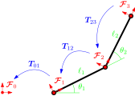

# Planning Playground

Examples of planning algorithms for robotics.

## Install

Get the repo:
```
git clone https://github.com/adamheins/planning-playground.git
```

Install dependencies (make sure you're using **Python 3.7+**):
```
cd planning-playground
python3 -m pip install -r requirements.txt
```

## Usage

### Geometry

Basic example of transforms associated with 2-link planar manipulator. In the
diagram below, there are four frames, where the transformation matrix $T_{ij}$
maps points expressed in Frame $j$ to Frame $i$.



Run the script:
```
python3 geometry.py
```

### Planning

Currently contains a basic 2D workspace with rectangular and circular
obstacles. Planning is done between two points (start is green and goal is
red). Planners are:

* Probabilistic road map (PRM)
* Grid

Run the script:
```
python3 planning.py
```
